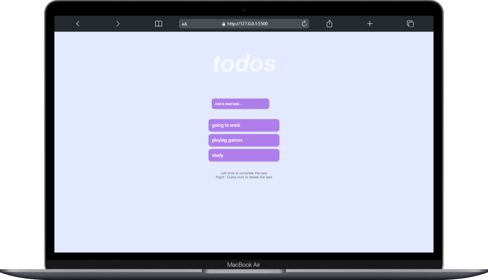

# To-Do List App

A simple and responsive To-Do List web application built with HTML, CSS, and JavaScript.

## Features

- Add new tasks using the input field.
- Mark tasks as completed by left-clicking on them.
- Delete tasks by right-clicking or double-clicking on them.
- Responsive design for desktop and mobile devices.

## Usage

1. Clone or download this repository.
2. Open `index.html` in your web browser.
3. Type a task in the input field and press Enter to add it.
4. Click a task to mark it as completed.
5. Right-click or double-click a task to delete it.

## File Structure

- [`index.html`](index.html): Main HTML file.
- [`style.css`](style.css): Styles for the app.
- [`script.js`](script.js): JavaScript logic for adding, completing, and deleting tasks.

## Demo

You can access the live project here:  
**[To-Do List App Live Demo](https://your-username.github.io/your-repo-name/)**

 <!-- Add a screenshot if available -->

## License

This project is open source and free to use.